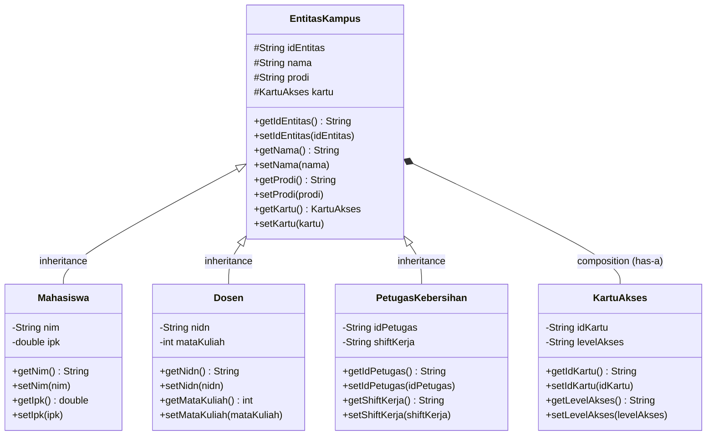
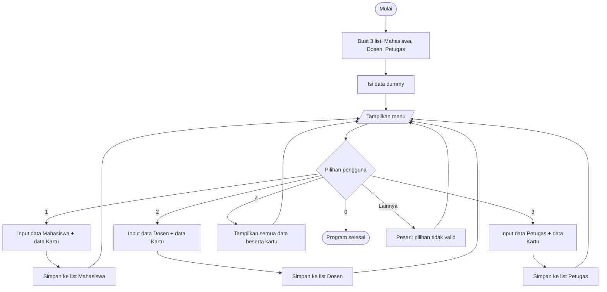

# TP3DPBO2526C2

## Janji

```
Saya Bentar Bintang Umeir dengan nim 2509865 mengerjakan TP3 dalam mata kuliah DPBO untuk 
keberkahanNya maka saya tidak melakukan kecurangan seperti yang telah dispesifikasikan. Aamiin
```

# Sistem Entitas Kampus

Program berbasis **Object-Oriented Programming (OOP)** untuk mengelola data entitas di lingkungan kampus (Mahasiswa, Dosen, dan Petugas Kebersihan), lengkap dengan kartu akses masing-masing. Program diimplementasikan dalam tiga bahasa dengan desain yang sama:

| Bahasa | Folder |
|--------|--------|
| C++    | `Cpp/` |
| Java   | `Java/` |
| Python | `Python/` |

---

## 1. Desain Diagram Program



**Keterangan notasi:**
- `<|--` : pewarisan (*inheritance*, relasi **is-a**)
- `*--` : komposisi (*composition*, relasi **has-a**)
- `#` : protected, `-` : private, `+` : public

---

## 2. Penjelasan Atribut dan Method Setiap Kelas

### 2.1 `KartuAkses`
Merepresentasikan kartu akses yang dimiliki sebuah entitas kampus.

| Atribut | Tipe | Keterangan |
|---------|------|------------|
| `idKartu` | String | Nomor/ID unik kartu |
| `levelAkses` | String | Level akses kartu (mis. Mahasiswa, Dosen, Petugas) |

| Method | Keterangan |
|--------|------------|
| `KartuAkses()` | Constructor default (tanpa parameter) |
| `KartuAkses(idKartu, levelAkses)` | Constructor berparameter untuk mengisi seluruh atribut |
| `getIdKartu()` / `setIdKartu()` | Getter & setter `idKartu` |
| `getLevelAkses()` / `setLevelAkses()` | Getter & setter `levelAkses` |

### 2.2 `EntitasKampus` (Kelas Induk / Superclass)
Kelas dasar yang memuat data umum yang dimiliki **semua** anggota kampus.

| Atribut | Tipe | Akses | Keterangan |
|---------|------|-------|------------|
| `idEntitas` | String | protected | ID unik entitas |
| `nama` | String | protected | Nama entitas |
| `prodi` | String | protected | Program studi (untuk petugas dipakai sebagai unit/gedung) |
| `kartu` | `KartuAkses` | protected | Objek kartu akses milik entitas (**composition**) |

| Method | Keterangan |
|--------|------------|
| `EntitasKampus()` | Constructor default |
| `EntitasKampus(idEntitas, nama, prodi)` | Constructor untuk mengisi data umum |
| `getIdEntitas()` / `setIdEntitas()` | Getter & setter `idEntitas` |
| `getNama()` / `setNama()` | Getter & setter `nama` |
| `getProdi()` / `setProdi()` | Getter & setter `prodi` |
| `getKartu()` / `setKartu()` | Getter & setter `kartu` |

### 2.3 `Mahasiswa` (turunan `EntitasKampus`)

| Atribut | Tipe | Keterangan |
|---------|------|------------|
| `nim` | String | Nomor Induk Mahasiswa |
| `ipk` | double | Indeks Prestasi Kumulatif |

| Method | Keterangan |
|--------|------------|
| `Mahasiswa()` | Constructor default |
| `Mahasiswa(idEntitas, nama, prodi, nim, ipk)` | Memanggil constructor induk untuk data umum, lalu mengisi `nim` dan `ipk` |
| `getNim()` / `setNim()` | Getter & setter `nim` |
| `getIpk()` / `setIpk()` | Getter & setter `ipk` |

### 2.4 `Dosen` (turunan `EntitasKampus`)

| Atribut | Tipe | Keterangan |
|---------|------|------------|
| `nidn` | String | Nomor Induk Dosen Nasional |
| `mataKuliah` | int | Jumlah mata kuliah yang diampu |

| Method | Keterangan |
|--------|------------|
| `Dosen()` | Constructor default |
| `Dosen(idEntitas, nama, prodi)` | Memanggil constructor induk; `nidn` dan `mataKuliah` diisi lewat setter |
| `getNidn()` / `setNidn()` | Getter & setter `nidn` |
| `getMataKuliah()` / `setMataKuliah()` | Getter & setter `mataKuliah` |

### 2.5 `PetugasKebersihan` (turunan `EntitasKampus`)

| Atribut | Tipe | Keterangan |
|---------|------|------------|
| `idPetugas` | String | ID kepegawaian petugas |
| `shiftKerja` | String | Shift kerja (mis. Pagi, Siang) |

| Method | Keterangan |
|--------|------------|
| `PetugasKebersihan()` | Constructor default |
| `PetugasKebersihan(idEntitas, nama, prodi, idPetugas, shiftKerja)` | Memanggil constructor induk, lalu mengisi `idPetugas` dan `shiftKerja` |
| `getIdPetugas()` / `setIdPetugas()` | Getter & setter `idPetugas` |
| `getShiftKerja()` / `setShiftKerja()` | Getter & setter `shiftKerja` |

### 2.6 `Main` (program utama)
Bukan kelas data, melainkan pengendali alur program. Fungsi pentingnya:

| Fungsi | Keterangan |
|--------|------------|
| `inputTeks / inputDesimal / inputInteger` | Membaca input pengguna; input angka divalidasi dan diulang sampai benar |
| `inputKartu()` | Membaca data kartu dan mengembalikan objek `KartuAkses` |
| `tambahMahasiswa / tambahDosen / tambahPetugas` | Membuat objek baru, mengisi datanya, lalu menyimpannya ke daftar (list/vector) |
| `tampilkanKartu(EntitasKampus)` | Menampilkan data kartu dari objek **apa pun** turunan `EntitasKampus` (polimorfisme) |
| `tampilkanSemua(...)` | Menampilkan seluruh data mahasiswa, dosen, dan petugas |
| `isiDataDummy(...)` | Mengisi data awal agar program langsung punya contoh data |

---

## 3. Penjelasan Desain Program

### 3.1 Inheritance (Pewarisan)
`Mahasiswa`, `Dosen`, dan `PetugasKebersihan` **mewarisi** `EntitasKampus`. Ketiganya sama-sama anggota kampus yang memiliki `idEntitas`, `nama`, `prodi`, dan `kartu`, sehingga atribut dan method umum itu cukup ditulis **sekali** di kelas induk (menghindari duplikasi kode / prinsip DRY). Setiap kelas turunan hanya menambahkan atribut khasnya:

- `Mahasiswa` → `nim`, `ipk`
- `Dosen` → `nidn`, `mataKuliah`
- `PetugasKebersihan` → `idPetugas`, `shiftKerja`

Constructor kelas turunan memanggil constructor induk (`super(...)` di Java/Python, *initializer list* di C++) untuk mengisi data umum. Atribut di induk bersifat **protected**, sehingga bisa diakses kelas turunan tetapi tetap tersembunyi dari luar kelas (enkapsulasi).

### 3.2 Composition (Komposisi)
`EntitasKampus` **memiliki** (*has-a*) objek `KartuAkses` sebagai atribut `kartu`. Kartu bukan jenis entitas, melainkan **bagian** dari entitas, sehingga relasinya komposisi, bukan pewarisan. Karena atribut `kartu` berada di kelas induk, ketiga kelas turunan otomatis memiliki kartu aksesnya sendiri. Kartu dibuat bersama entitas dan melekat padanya; setiap entitas punya objek kartu terpisah. Dengan memisahkan `KartuAkses` menjadi kelas sendiri, data kartu (`idKartu`, `levelAkses`) tidak bercampur dengan data entitas dan mudah dikembangkan.

### 3.3 Polimorfisme
Karena `Mahasiswa`, `Dosen`, dan `PetugasKebersihan` semua adalah `EntitasKampus` (*is-a*), objek dari ketiganya dapat diperlakukan sebagai tipe induknya. Contohnya fungsi `tampilkanKartu(EntitasKampus &e)`: satu fungsi yang sama dapat menerima objek `Mahasiswa`, `Dosen`, maupun `PetugasKebersihan` tanpa perlu membuat tiga fungsi terpisah. Fungsi tersebut hanya memakai method milik induk (`getKartu()`), yang berlaku untuk semua turunan. Ini adalah polimorfisme berbasis subtipe (*subtype polymorphism*), yang membuat kode lebih ringkas dan mudah diperluas: jika kelas turunan baru ditambahkan (mis. `Staf`), fungsi yang sama langsung dapat dipakai tanpa perubahan.

### 3.4 Enkapsulasi
Atribut kelas turunan dan `KartuAkses` bersifat **private**, dan diakses hanya melalui getter dan setter. Dengan begitu, perubahan data terkontrol dan struktur internal kelas dapat diubah tanpa memengaruhi kode lain.

### Ringkasan Relasi

| Relasi | Kelas | Jenis |
|--------|-------|-------|
| `Mahasiswa` → `EntitasKampus` | Pewarisan | is-a |
| `Dosen` → `EntitasKampus` | Pewarisan | is-a |
| `PetugasKebersihan` → `EntitasKampus` | Pewarisan | is-a |
| `EntitasKampus` → `KartuAkses` | Komposisi | has-a |

---

## 4. Alur Program

Alur program sama untuk semua bahasa (C++, Java, Python).



**Penjelasan langkah:**
1. Program dimulai dengan membuat tiga list penampung: mahasiswa, dosen, dan petugas kebersihan.
2. `isiDataDummy()` mengisi masing-masing list dengan 2 data contoh.
3. Menu ditampilkan berulang sampai pengguna memilih `0`.
4. **Menu 1/2/3**: pengguna mengisi data entitas (ID, nama, prodi, serta atribut khusus), lalu data kartu akses (ID kartu dan level akses). Input angka (IPK, jumlah mata kuliah) divalidasi dan diminta ulang bila salah. Objek disimpan ke list yang sesuai.
5. **Menu 4**: seluruh data ditampilkan per kategori, dan data kartu setiap entitas ditampilkan lewat fungsi polimorfik `tampilkanKartu()`.
6. **Menu 0**: program berhenti.

---

## 5. Cara Menjalankan

**C++**
```bash
cd Cpp (jika posisi belum pada directory bahasa)
c++ Main.cpp -o a.exe && a
```

**Java**
```bash
cd Java
javac *.java
java Main
```

**Python**
```bash
cd Python
python Main.py
```

---

## 6. Contoh Tampilan

```
    1. Bahasa C++
```


## 7. Struktur Folder

```
TP3DPBO2526C2/
├── Cpp/      (Main, EntitasKampus, KartuAkses, Mahasiswa, Dosen, PetugasKebersihan)
├── Java/     (file .java dengan struktur kelas yang sama)
├── Python/   (file .py dengan struktur kelas yang sama)
└── README.md
```
